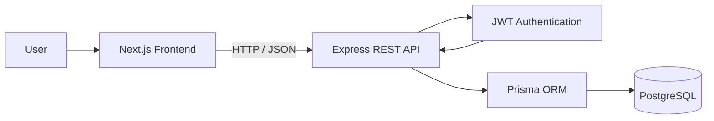
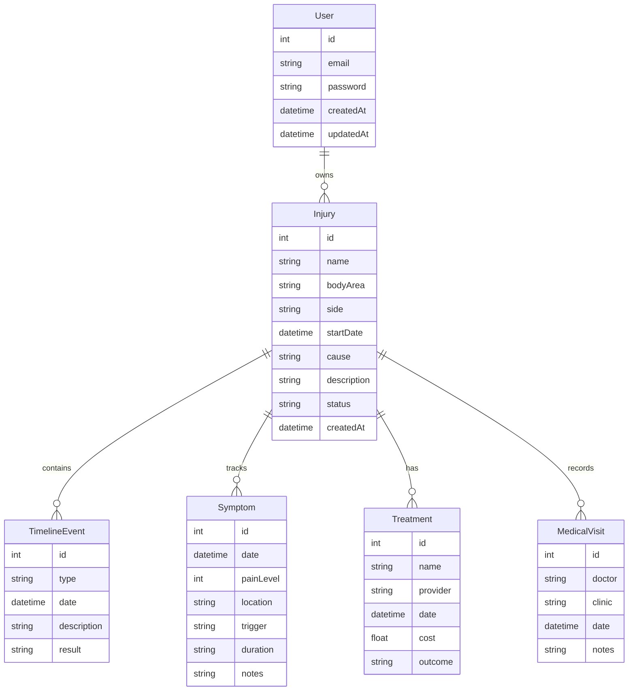

# Injury Journal

A full-stack application for organizing and tracking a personal injury journey.

## Overview

Injury Journal helps people with chronic injuries organize their medical history, track symptoms, record treatments, and build a chronological timeline that can be shared with healthcare professionals.

The goal is to reduce the frustration of repeating medical history during appointments and provide patients with a clearer view of their healthcare journey.

---

## Problem

People managing chronic injuries often have medical information scattered across:

- medical reports
- specialist visits
- imaging results
- treatment notes
- personal notes

Over time, it becomes difficult to remember:

- when symptoms started
- which treatments were tried
- what helped or did not help
- important medical events

---

## Features

Current features:

- User registration and authentication
- JWT-based protected routes
- Create and manage injury profiles
- Track symptoms related to injuries
- Record treatments and outcomes
- Record medical visits
- Create injury timeline events
- Full CRUD operations for injury data
- Request validation using Zod
- Secure password hashing with bcrypt

---

## Tech Stack

### Backend

- Node.js
- Express.js
- PostgreSQL
- Prisma ORM
- JWT authentication
- Zod validation

## Architecture



## Database Design

> **Note:** Fields marked as nullable in the Prisma schema may contain `NULL`.



### Security

- Helmet security headers
- CORS configuration
- Rate limiting
- Protected API routes
- User authorization checks

### Testing

- Jest
- Supertest

# API Endpoints

All endpoints are prefixed with:

```
/api
```

## Authentication

| Method | Endpoint         | Description                 |
| ------ | ---------------- | --------------------------- |
| POST   | `/auth/register` | Register a new user         |
| POST   | `/auth/login`    | Login and receive JWT token |

---

## Injuries

| Method | Endpoint        | Description         |
| ------ | --------------- | ------------------- |
| POST   | `/injuries`     | Create injury       |
| GET    | `/injuries`     | Get user's injuries |
| GET    | `/injuries/:id` | Get injury by id    |
| PUT    | `/injuries/:id` | Update injury       |
| DELETE | `/injuries/:id` | Delete injury       |

---

## Timeline Events

| Method | Endpoint                     | Description           |
| ------ | ---------------------------- | --------------------- |
| POST   | `/injuries/:injuryId/events` | Create timeline event |
| GET    | `/injuries/:injuryId/events` | Get timeline events   |
| PUT    | `/events/:id`                | Update timeline event |
| DELETE | `/events/:id`                | Delete timeline event |

---

## Symptoms

| Method | Endpoint                       | Description    |
| ------ | ------------------------------ | -------------- |
| POST   | `/injuries/:injuryId/symptoms` | Create symptom |
| GET    | `/injuries/:injuryId/symptoms` | Get symptoms   |
| PUT    | `/symptoms/:id`                | Update symptom |
| DELETE | `/symptoms/:id`                | Delete symptom |

---

## Treatments

| Method | Endpoint                         | Description      |
| ------ | -------------------------------- | ---------------- |
| POST   | `/injuries/:injuryId/treatments` | Create treatment |
| GET    | `/injuries/:injuryId/treatments` | Get treatments   |
| PUT    | `/treatments/:id`                | Update treatment |
| DELETE | `/treatments/:id`                | Delete treatment |

---

## Medical Visits

| Method | Endpoint                     | Description          |
| ------ | ---------------------------- | -------------------- |
| POST   | `/injuries/:injuryId/visits` | Create medical visit |
| GET    | `/injuries/:injuryId/visits` | Get medical visits   |
| PUT    | `/visits/:id`                | Update medical visit |
| DELETE | `/visits/:id`                | Delete medical visit |

---

# Installation

Clone the repository:

```bash
git clone <repository-url>
cd injury_journal/backend
```

Install dependencies:

```bash
npm install
```

Create environment variables:

```
DATABASE_URL=
JWT_SECRET=
FRONTEND_URL=
```

Run database migrations:

```bash
npx prisma migrate dev
```

Start development server:

```bash
npm run dev
```

---

# Running Tests

Run the test suite:

```bash
npm test
```

Tests cover:

- authentication
- authorization
- protected routes
- CRUD operations
- validation

---

## Future Improvements

Planned features:

- React frontend
- Medical document uploads
- AI-generated medical timeline summaries
- Exportable medical history reports
- Improved healthcare navigation support

---

## Status

🚧 MVP backend completed.

Current focus:

- Multi-step injury creation workflow
- Dashboard UX improvements
