# Injury Journal AI — Architecture

## 1. Overview

Injury Journal AI is an AI assistant built on top of an existing Injury Journal PostgreSQL application.

The system is designed to transform structured journal data into searchable AI context and use that context to generate grounded answers about the user's injury history.

The architecture is divided into two main flows:

- **Offline flow** — prepares journal data for AI retrieval by transforming records into documents, chunking them, generating embeddings, and storing the resulting vectors.
- **Online flow** — processes user questions through safety checks, authorization, retrieval, RAG, LLM generation, and citation generation.

The architecture also includes supporting systems for:

- **Evaluation** — measuring retrieval and answer quality.
- **Observability** — monitoring AI workflows and operational behavior.
- **Production infrastructure** — AWS services and infrastructure as code.
- **Security** — authentication, authorization, data isolation, and protection of journal data.

The system is intentionally built incrementally. The offline data and retrieval foundations are implemented before introducing the AI agent and production workflow.

## 2. Technology Stack

| Area            | Technology                |
| --------------- | ------------------------- |
| Language        | TypeScript                |
| Backend         | Node.js                   |
| API             | REST                      |
| Database        | PostgreSQL                |
| ORM             | Prisma                    |
| Vector Database | PostgreSQL + pgvector     |
| Embeddings      | Embedding model API       |
| LLM             | LLM API                   |
| RAG             | Custom RAG pipeline       |
| Agent (current) | Hand-written state machine (deterministic intent routing) |
| Agent (planned) | LangGraph — deferred until workflows need multi-step/dynamic tool selection |
| Safety          | Application guardrails    |
| Evaluation      | Custom evaluation harness |
| Observability   | CloudWatch / DynamoDB     |
| Cloud           | AWS                       |
| Workflow        | Step Functions            |
| Compute         | Lambda                    |
| IaC             | Terraform                 |

## 3. High-Level Architecture

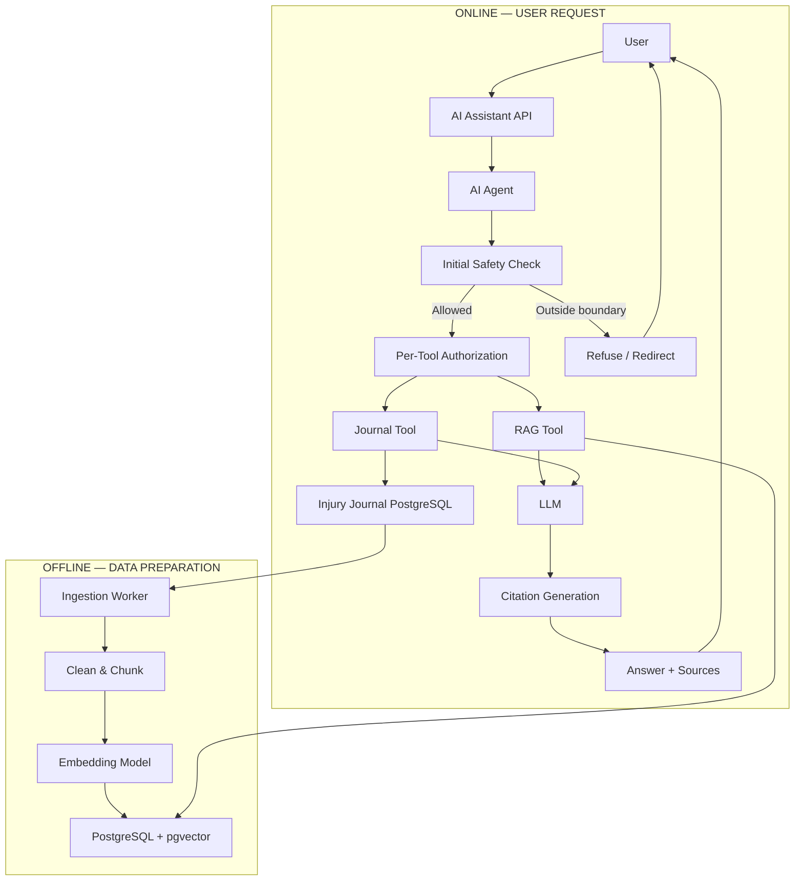

> **Current status:** "Per-Tool Authorization" (`AUTH`) and "Citation Generation" (`CIT`) are
> shown here as part of the built flow. Per-tool authorization is now built (issue #95) —
> `rag-tool.ts`, `journal-tool.ts`, and `vector-storage.ts` filter by the authenticated
> `req.userId`. Citation generation exists, but only as citation-building from retrieved chunks;
> it is not checked against the generated answer. See §5.5 and §10 for the current-vs-planned
> detail on each.

## 4. Offline Architecture

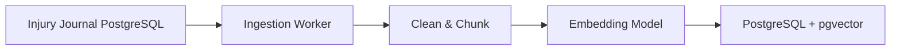

### 4.1. Offline Ingestion Pipeline

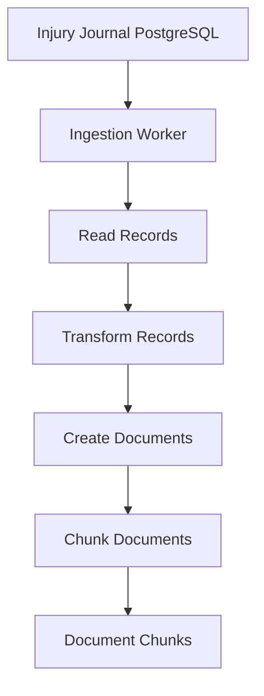

> **Current status:** every stage is implemented and unit/integration tested
> (`postgres-reader.ts`, `document-builder.ts`, `document-chunker.ts`, `embed-and-store.ts`). The
> "Ingestion Worker" node is also built (`src/ingestion/ingestion-worker.ts`, issue #40) and is
> runnable via `npm run ingest`, calling the stages in sequence with idempotent storage and
> concurrent-run serialization (`ingestion-lock.ts`).

### 4.2. Embedding Architecture

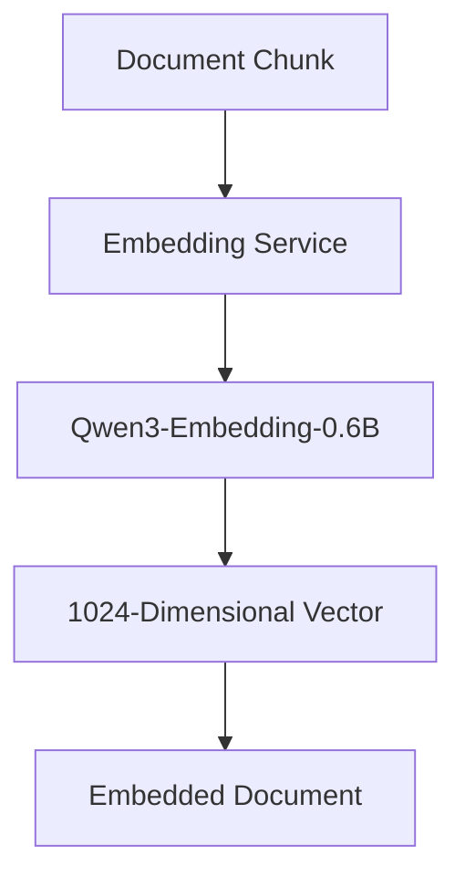

> **Design gap — fix implemented, pending merge confirmation:** Qwen3-Embedding-0.6B is designed
> for *asymmetric* retrieval — documents and queries should be embedded differently (queries use
> an instruction-style prompt, documents don't) for best retrieval quality. The embedding service
> implements both (`embed_document()` and `embed_query()` in `embedding_service.py`); as of PR #55
> (issue #37) the API layer adds a dedicated `/embed-query` route and the retrieval path
> (`semantic-search.ts`) calls it via `embedQuery()` instead of the document-side endpoint. Check
> the PR/issue directly for current merge status rather than relying on this document. See §11
> (Decision D3) below.

### 4.3. Vector Storage with pgvector Architecture

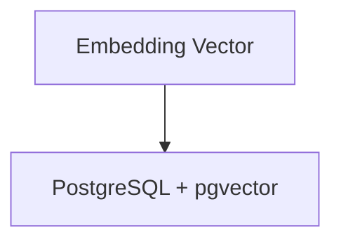

> **Implemented beyond this diagram:** storage is idempotent — writes use
> `INSERT ... ON CONFLICT (sourceType, sourceId, chunkIndex) DO UPDATE`, and re-ingesting a
> record that now produces fewer chunks prunes the stale ones (`deleteDocumentChunksExcept`).
> Concurrent ingestion of the same source record is serialized by an in-process lock
> (`ingestion-lock.ts`). This machinery is real, tested, and working, but isn't shown here.

## 5. Online Architecture

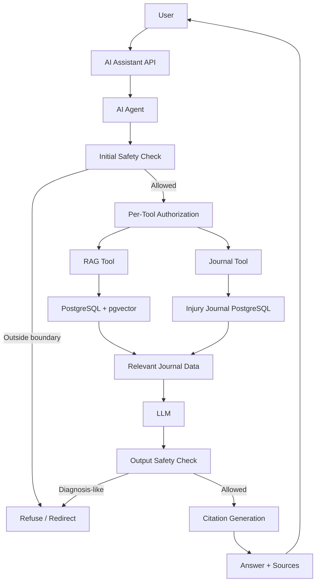

> Same caveat as §3: `AUTH` ("Per-Tool Authorization") is built (#95); `CIT` ("Citation
> Generation") exists but isn't checked against the generated answer. See §5.5. `OSC`
> ("Output Safety Check") is `checkAnswerSafety` — see §5.4 for what it actually checks.

### 5.1. Semantic Retrieval Architecture

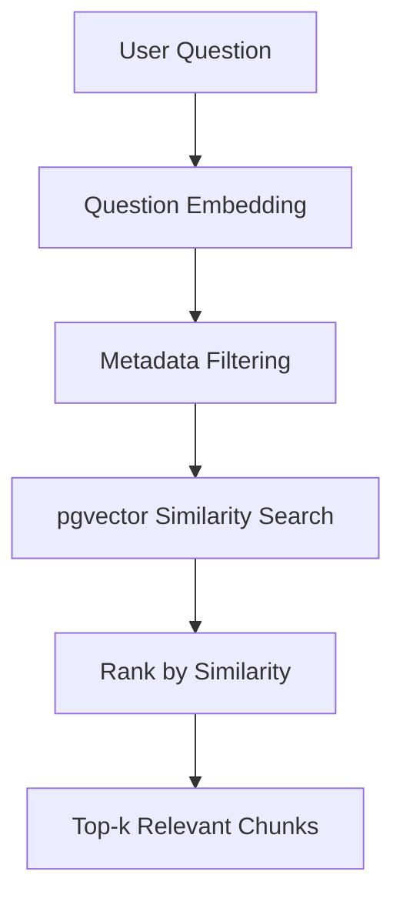

> **Current status:** "Question Embedding" now uses the query-specific `/embed-query` endpoint as
> of PR #55 (issue #37) — see §4.2's design-gap note for the merge-status caveat. "Metadata
> Filtering" is `injuryId` and `userId` in production — `userId` filtering was added for
> authorization (issue #95, see D10) and is now always passed by `rag-service.ts` as the
> authenticated caller's id, not an optional filter. `searchSimilarChunks` also accepts an optional
> `sourceType` parameter; no production caller passed one until #209 (D11), where injury-routing
> queries `sourceType: 'injury'` chunks specifically. Date-range filtering is still not implemented
> (deliberately deferred pending evaluation data, per issue #35). As of #122 (see D5), "Top-k
> Relevant Chunks" is now filtered by a cosine-distance cutoff (`maxDistance` on
> `searchSimilarChunks`, default `0.7`, not yet evaluation-tuned) before returning — a question with
> no chunks close enough gets an explicit no-relevant-context answer from `rag-service.ts` instead
> of an LLM-generated one over irrelevant context.
> As of #209 (see D11), when `injuryId` is omitted this diagram's "Metadata Filtering" step is
> preceded by an injury-routing step (`injury-router.ts`) that picks the `injuryId`(s) to filter on
> from the question itself, instead of searching unfiltered across all of a user's injuries.
> As of #133 (see D12), "Metadata Filtering" also always includes an `embeddingModel`/
> `embeddingModelVersion` match against the query's own embedding metadata — not optional, and not
> shown as a separate diagram step since it applies uniformly to every call.

### Sequence Diagram

> Originated from a Greptile-generated PR summary (PR #55) and independently verified against
> the merged code before inclusion here.

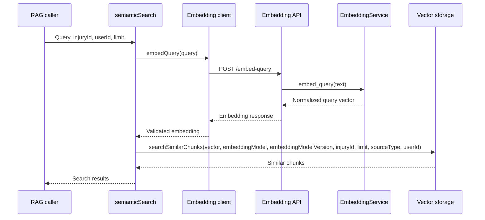

### 5.2. Basic RAG Architecture

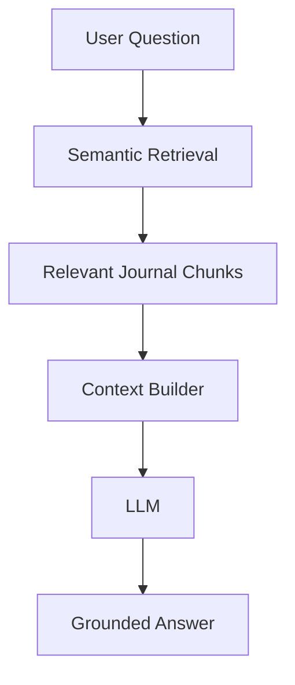

### 5.3. Citation Architecture

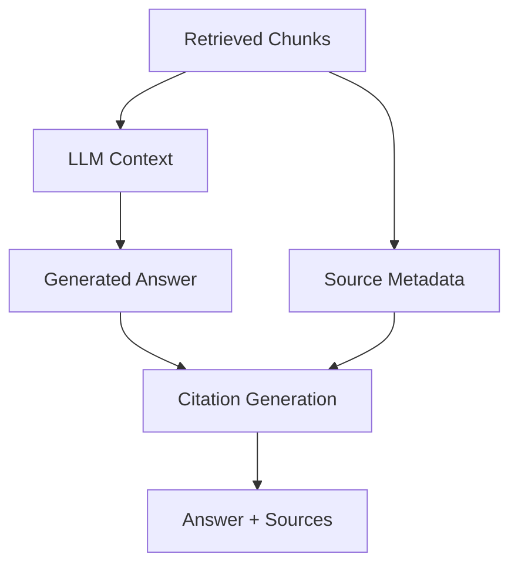

> **Current status:** only "Citation Generation" from retrieved-chunk metadata is live
> (`citation-builder.ts`) — it does not consult the generated answer (`A` in this diagram feeds
> `V` conceptually, but no code path actually inspects the LLM's output when building citations).
> Three additional modules exist for source verification and formatting
> (`citation-verifier.ts`, `citation-source-mapper.ts`, `citation-formatter.ts`) but are not
> wired into any response path yet — they represent planned work, not alternate current
> behavior. Today's citations are a provenance list of what was retrieved, not a fact-checked
> bibliography of what the answer actually used.

### 5.4. Safety Guardrails Architecture

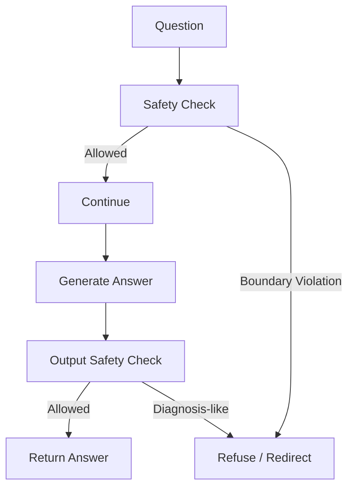

> **Current status:** three checks exist, all pattern-based text filtering, no LLM-level
> classification. `checkSafety` (`src/safety/safety-service.ts`) inspects the raw question before
> retrieval; `checkAnswerSafety` in the same file inspects the LLM's generated answer afterward (in
> `rag-service.ts` and the journal-intent branch of `ai-agent-orchestrator.ts`) and withholds it
> if the LLM hedges toward its own diagnostic judgment ("you may have...", "this could be...").
> `checkAnswerSafety` also receives the retrieved chunks / journal record text as grounding
> evidence, and blocks a definite diagnostic statement ("you have X", "diagnosis: X") whose
> asserted term does not appear anywhere in that evidence (issue #142) — a definite restatement
> of a diagnosis already in the record is still allowed, since that's the app's core
> journal-summary behavior. This grounding check is still keyword-based: a diagnostic statement
> using a specific medical term outside `CONDITION_KEYWORDS` is invisible to it, same as every
> other pattern in this module. `CONDITION_KEYWORDS` was expanded with several known-bypassing
> terms (issue #143), but the list remains finite and hand-maintained; closing the gap for
> arbitrary open-vocabulary terms is tracked under #140 (guardrails framework evaluation).
>
> A third check, `checkContentSafety`, was added (issue #66) to close a gap where neither existing
> check ever inspected the journal/RAG-derived *content* interpolated into the prompt — only the
> question and the final answer. It runs on the assembled context (`buildContext()` output for the
> RAG path, `formatInjuryRecord()` output for the journal path) before the LLM call, looking for
> prompt-injection-style phrasing (e.g. "ignore previous instructions", "you are now a..."). This
> is defense-in-depth, not the primary control: the primary control is that `prompt-builder.ts` now
> sends fixed instructions as a `system`-role message (`SYSTEM_PROMPT`) separate from the
> `user`-role message carrying the question and context, with journal/RAG content wrapped in
> `<journal_data>` tags the system prompt explicitly marks as untrusted data. Literal
> `<journal_data>`/`</journal_data>` occurring inside stored content is neutralized before
> interpolation so it can't forge a fake boundary — including whitespace-tolerant variants
> (e.g. `< /journal_data>`), not just the exact tag spelling. Like the other two checks, this is regex-based
> and will always be a step behind real-world phrasing — it narrows the attack surface, it doesn't
> eliminate it.

### 5.5. AI Agent Architecture

The agent decides which tools are necessary.

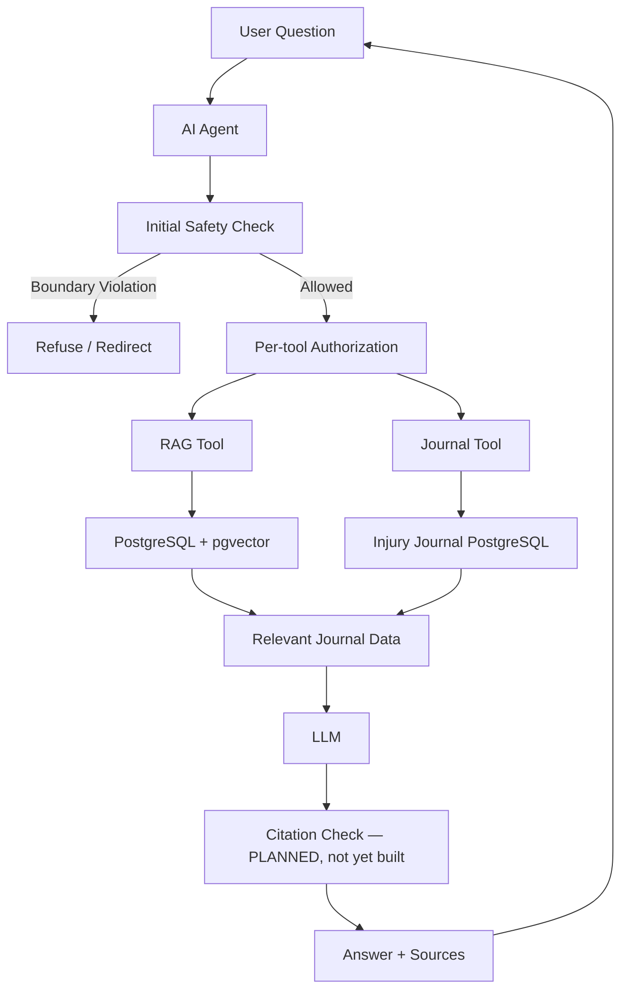

> **Current status vs. this diagram:**
> - "Per-tool Authorization" is built (#95) — `rag-tool.ts`, `journal-tool.ts`, and
>   `vector-storage.ts` filter by the authenticated `req.userId`. See
>   `docs/04-implementation-roadmap.md` for the rest of the closed security scope.
> - "Citation Check" does not exist — citations are built from retrieved chunks only (§5.3), with
>   no verification against what the LLM actually generated.
> - Tool selection ("the agent decides which tools are necessary") is currently fixed-keyword
>   matching on the question text, not model-driven decision-making — an intentional MVP
>   simplification, deferred until multi-step workflows justify an LLM planner or LangGraph.
> - The RAG Tool and Journal Tool are not symmetric today: the RAG path runs the full
>   retrieval → LLM → citation pipeline shown above; the Journal Tool path returns the raw
>   database record with no LLM synthesis and no citations. This is an unfinished placeholder,
>   not a deliberate design choice.

## 6. Evaluation Architecture

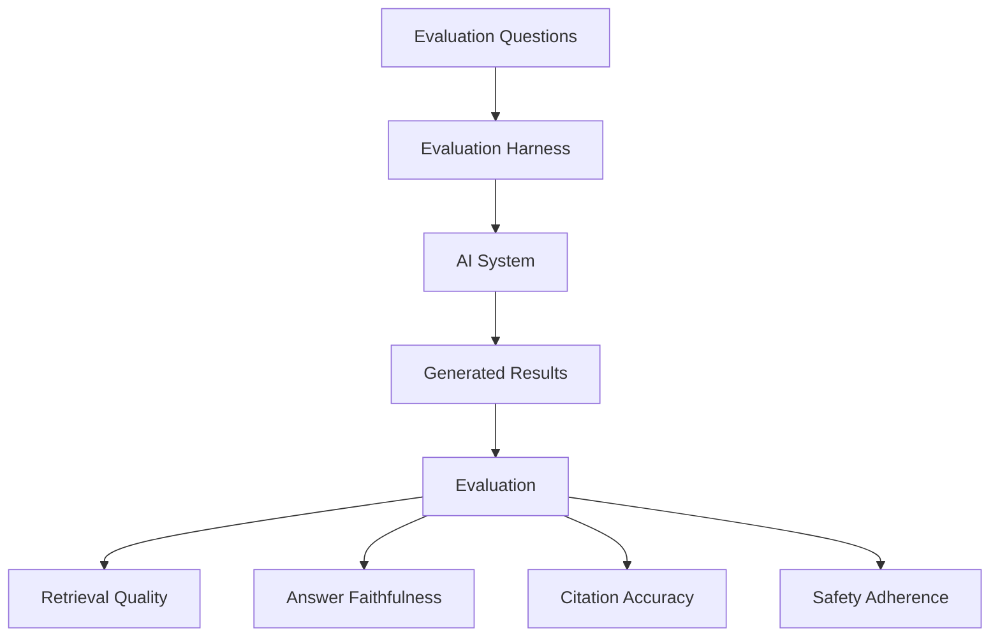

> **Current status:** the harness now implements six evaluation dimensions (safety, citations,
> intent, retrieval, no-information, and faithfulness). See `evaluation/ai-system/` for the
> current implementation and `evaluation/ai-system/dataset.json` for current dataset size and
> coverage (see Decision D5 in §11 for why dataset size matters beyond just this section).

## 7. Observability Architecture

### 7.1 AI Observability

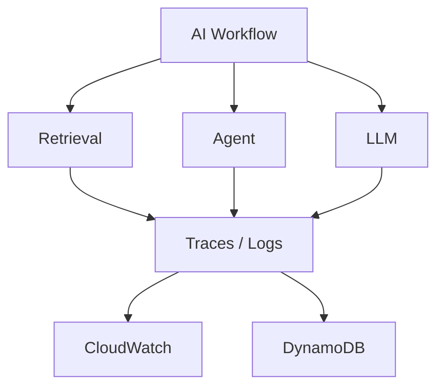

### 7.2 AI-Assisted Observability

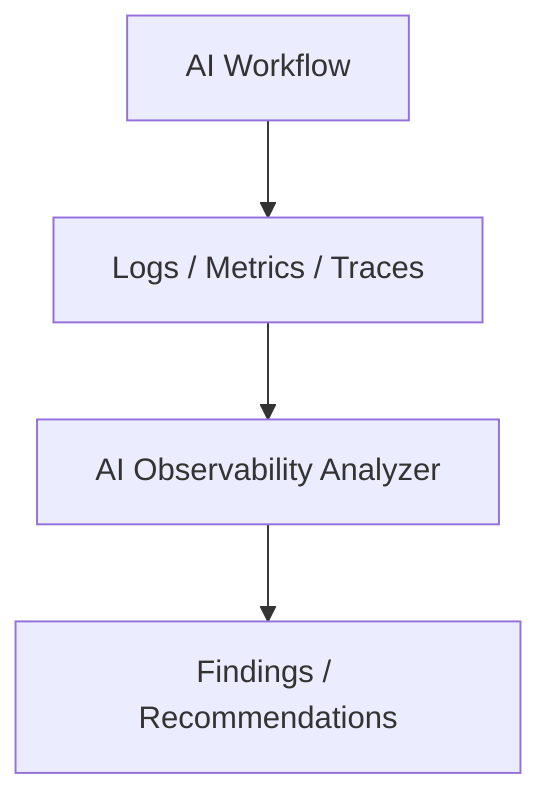

> §7 as a whole is not implemented yet (roadmap Step 6). One recommendation worth acting on before
> this step starts: thread a request ID through the pipeline now, even as a no-op passed-through
> parameter, rather than retrofitting it into every function signature later — none of the current
> pipeline stages carry one today.

## 8. Production / AWS Architecture

### 8.1. Production Workflow

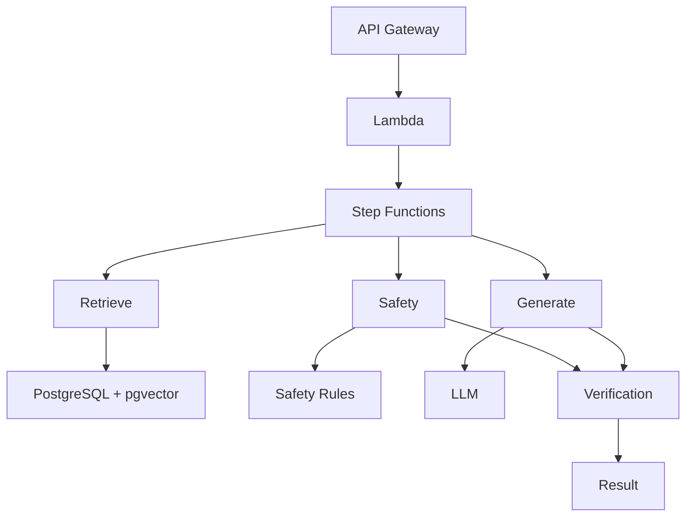

### 8.2. Workflow Reliability

Step Functions provides:

- State management
- Retries
- Timeouts
- Failure handling
- Multi-step orchestration

Side-effecting operations must be designed to be idempotent so retries do not create duplicate data or unintended effects.

> Note: the offline ingestion path already meets this bar today (see §4.3) — that work does not
> need to be redone when this step starts, only re-platformed.

## 9. Infrastructure as Code: Terraform Architecture

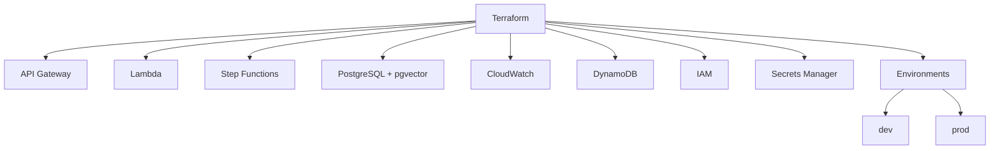

> Not implemented yet (roadmap Step 8). One architectural note worth deciding early (related to
> Decision D3 in §11): the embedding service is a separate Python process
> with a heavier runtime footprint (a loaded transformer model) than anything else in the stack —
> decide whether it stays a long-lived service, a sidecar, or a batch/Lambda-friendly on-demand
> load before this Terraform work starts, since those have very different cost/latency profiles.

## 10. Security Architecture: authorization design

> **Current status: built.** `POST /ai-agent` requires a Bearer JWT (issue #94), and every
> request is scoped to the authenticated `req.userId`: `rag-tool.ts` and `journal-tool.ts` filter
> by owner, and `vector-storage.ts`'s `searchSimilarChunks` filters vector search results by a
> real, indexed `userId` column on `DocumentChunk` (issue #41) rather than an unindexed JSON
> blob. A caller can no longer supply an arbitrary `injuryId` and receive another user's data
> (issue #95). This diagram matches current behavior.

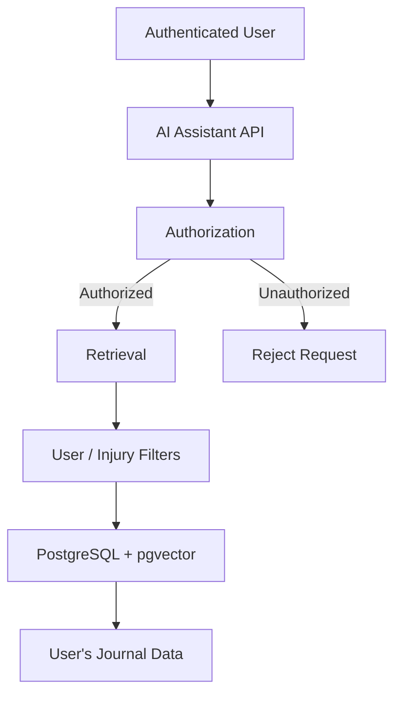

### 10.1 Accepted risks (not yet mitigated)

- **Third-party LLM data exposure (Groq) — resolved, issue #117:** every RAG answer sends matched
  journal excerpts — personal medical/injury data — to Groq's API (`src/llm/llm-client.ts`).
  **Decision: accept as-is, no redaction/minimization code.** Groq's default policy does not
  retain inputs/outputs except up to 30 days of troubleshooting/abuse logs, and never trains on
  customer data without explicit opt-in; Zero Data Retention (ZDR), removing even that 30-day
  window, can be enabled in the Groq Console. Minimization would add complexity and degrade answer
  quality, which isn't justified for this project's exposure. Enabling ZDR is an account-level
  action outside this repo.
- **Embedding service auth (#118):** Resolved. `EMBEDDING_API_URL` (the Python/FastAPI service)
  now requires a shared `EMBEDDING_API_KEY` sent as a `Bearer` token, verified via a FastAPI
  dependency (`verify_api_key` in `embedding_api.py`) with a constant-time comparison, and fails
  closed (500) if the key isn't configured. `embedding-client.ts` sends the key on every request.
  The service's `/docs`, `/redoc`, and `/openapi.json` are also disabled, since FastAPI's
  app-level `dependencies` list doesn't cover those auto-generated routes.

### 10.2 Rate limiting

A two-tier limiter (`src/app.ts`, issues #89/#145) sits alongside the authorization design above:
a per-IP limit (40 req/60s) runs ahead of `authenticate` to bound anonymous/invalid-token traffic,
and a stricter per-user limit keyed by `req.userId` runs after (20 req/60s for `/ai-agent`, 60
req/60s for `/injuries`). See `docs/05-api-contract.md` §3 for exact values and response shape.

## 11. Architectural Decision Log

For each major decision: what was chosen, why (as inferred from code, `CLAUDE.md`, and commit
history — this project has no separate ADR history, so rationale below is reconstructed, not
quoted), what else was considered, whether it still holds, and whether it should be revisited.

### D1 — PostgreSQL + pgvector for vector storage (not a dedicated vector database)

- **DECISION:** Store embeddings as a `vector(1024)` column on `DocumentChunk` inside the same
  PostgreSQL database as the domain data, queried via `pgvector`'s `<=>` operator.
- **RATIONALE:** The domain data (`Injury` and children) already lives in PostgreSQL. Keeping
  vectors alongside it avoids a second system to run, deploy, and keep in sync, and keeps
  `injuryId`-scoped filtering a plain SQL `WHERE` clause rather than a cross-system join. `CLAUDE.md`
  lists a separate vector database under "Do NOT introduce," framing this as a considered and
  rejected alternative, not an oversight.
- **ALTERNATIVES CONSIDERED:** A dedicated vector database (Pinecone, Qdrant, Weaviate, etc.) —
  better suited to very large corpora or approximate-search tuning, at the cost of a second data
  store and a sync/consistency problem between it and PostgreSQL.
- **CURRENT STATUS:** Still valid. Corpus size (per-user journal entries) is small enough that
  pgvector's exact/IVF search is not a bottleneck, and there's no evidence of scale pressure yet.
- **SHOULD THIS BE REVISITED:** No — revisit only if corpus size or query volume grows by orders
  of magnitude; no signal that's imminent.

### D2 — Prisma as ORM, with raw SQL for the vector column

- **DECISION:** Use Prisma for all relational models and standard CRUD, but drop to
  `prisma.$queryRaw`/`$executeRaw` specifically for `DocumentChunk`'s `embedding` column, since
  Prisma cannot type or query `vector` natively (declared `Unsupported("vector(1024)")` in the
  schema).
- **RATIONALE:** Prisma's schema-driven typing and migrations are valuable for the bulk of the
  domain model; the vector column is the one place that needs an escape hatch. This is a targeted
  compromise, not a wholesale move away from the ORM.
- **ALTERNATIVES CONSIDERED:** A raw SQL/query-builder layer (e.g. Knex, Kysely) for the whole
  data layer — would make vector queries uniform with the rest, at the cost of losing Prisma's
  migration/typing benefits everywhere else. A community Prisma `pgvector` extension/generator —
  would remove the raw-SQL escape hatch but adds a third-party dependency for one column.
- **CURRENT STATUS:** Still valid. The raw-SQL boundary is small (`vector-storage.ts`) and
  isolated; it hasn't spread.
- **SHOULD THIS BE REVISITED:** No.

### D3 — Qwen3-Embedding-0.6B, self-hosted via a separate Python FastAPI service

- **DECISION:** Run embeddings through a small, separately-deployed Python service
  (`embedding_api.py` / `embedding_service.py`) rather than calling a hosted embeddings API from
  Node.
- **RATIONALE:** `Qwen3-Embedding-0.6B` isn't available as a hosted API from the LLM provider
  already in use (Groq) or another already-integrated vendor; self-hosting a small (0.6B) model is
  cheap enough to run locally/on modest infrastructure, and keeps embedding cost and latency fully
  in the project's own control. `CLAUDE.md` explicitly lists "a hosted embeddings API" under "Do
  NOT introduce," again framing this as evaluated and rejected rather than deferred.
- **ALTERNATIVES CONSIDERED:** A hosted embeddings API (OpenAI, Cohere, Voyage, etc.) — simpler
  operationally (no second runtime to deploy/scale), at the cost of per-call cost/latency and
  vendor lock-in on a component this project wanted to control directly.
- **CURRENT STATUS:** Partially outdated in one specific way — the service already implements
  Qwen3's asymmetric query/document prompting (`embed_document()` / `embed_query()`), but the
  query path historically called the document-side endpoint, silently degrading retrieval quality.
  A fix was implemented via PR #55 (issue #37) — check the PR/issue directly for current merge
  status rather than relying on this document. Separately, the missing dependency manifest for
  this service (no `requirements.txt`/`pyproject.toml`) is tracked as issue #56.
- **SHOULD THIS BE REVISITED:** Maybe — not the model/self-hosting choice itself, but the
  service's operational maturity (dependency pinning, packaging — issue #56 — and, per §9 above, a
  decision on whether it stays a long-lived service, a sidecar, or an on-demand load before the
  Terraform work in Step 8 starts).

### D4 — Recursive paragraph → sentence → sub-sentence chunking, no fixed-size/sliding-window chunking

- **DECISION:** Chunk each `JournalDocument` by first checking if it fits under a token limit
  whole; if not, split by paragraph, then by sentence, then by raw sub-sentence pieces if a single
  sentence still exceeds the limit — never truncating mid-sentence when avoidable. Adjacent chunks
  now also carry a small token-budgeted overlap (issue #135, partial fix of #35): the tail of one
  chunk is seeded as the start of the next, so content sitting right at a chunk boundary isn't
  isolated from its surrounding context for embedding similarity matching.
- **RATIONALE:** Journal entries are short, structured records (a symptom note, a treatment
  entry), not long-form prose — most fit in one chunk unchanged. The recursive strategy preserves
  natural language boundaries for the minority of longer entries, which matters more for citation
  readability and grounding fidelity than uniform chunk sizing would. The overlap addition keeps
  that boundary-respecting strategy but closes the specific gap where a paragraph/sentence/word
  split still landed a meaningful idea right at a hard cut.
- **ALTERNATIVES CONSIDERED:** Fixed-size sliding-window chunking (with overlap) — simpler to
  implement and reason about token budgets for, but would routinely cut a single symptom/treatment
  note across chunk boundaries, weakening both retrieval precision and citation coherence for
  content that's naturally already short. Overlap was added to the recursive strategy instead of
  switching to fixed-size windows, preserving the boundary-respecting behavior above.
- **CURRENT STATUS:** Still valid and well-tested (`document-chunker.ts` plus
  `docs/03-chunker-architecture.md`'s test list covers boundary cases directly, including overlap).
  Overlap means adjacent chunks can return near-duplicate text from retrieval (see D5); as of #215,
  `semanticSearch` (`src/retrieval/semantic-search.ts`) over-fetches and, when it finds a run of
  mutually-adjacent chunks (`sourceType`+`sourceId`+`chunkIndex` within 1 of each other — a pair or
  longer), still returns every chunk in that run — it just doesn't let the run consume more than
  one of the `limit` distinct-source slots. Nothing is ever dropped: given this is healthcare
  journal content, losing a chunk's unique content to save a result slot was judged the wrong
  tradeoff, so the result can exceed `limit` instead (bounded by the over-fetch pool size, see D5).
- **SHOULD THIS BE REVISITED:** No.
- **`DEFAULT_MAX_TOKENS` (300) is now measured, not assumed (#137):** `evaluation/ai-system/chunk-size-sweep.ts`
  (`npm run eval:chunk-size`) re-ingests the seeded dev dataset and re-runs the eval harness at
  maxTokens = 150/300/450/600 (effective split budgets ~123/246/369/492 after `QWEN_SAFETY_MARGIN`
  above). Result, verified against the post-safety-margin chunker (but not yet re-verified against
  chunk overlap, #214 — see below): retrieval (20/21) and citations (21/21) were identical across
  all four sizes — most journal records are short enough to fit in one chunk regardless of the
  limit, so chunk size rarely changes what gets chunked/retrieved for this dataset. Faithfulness
  (LLM-judged, so somewhat noisy) was 19/21, 21/21, 19/21, 20/21 respectively, with 300 scoring
  best. No value beat 300 on any metric, so the default was left unchanged. Re-run the sweep if the
  eval dataset grows to include longer records, if `QWEN_SAFETY_MARGIN` changes, or if this stops
  holding.
  - **Pending:** #214 (chunk overlap, default-on) merged after this was last measured. The sweep
    hasn't been re-run against it yet — the attempt hit Groq's daily token quota (200k TPD) rather
    than a transient rate limit. Re-run `npm run eval:chunk-size` once quota resets and update this
    note; overlap changes what content lands in each chunk, so it could plausibly shift retrieval
    even though chunk size alone didn't.
  - **Interaction with #218 (`SOURCE_TYPE_CHUNK_CONFIG`):** the sweep sets an explicit `maxTokens`
    for every document (uniformly, across all `sourceType`s) via `runIngestion`, which per
    `docs/03-chunker-architecture.md` overrides `SOURCE_TYPE_CHUNK_CONFIG` entirely — the sweep
    only answers "what should the one global default be," not "should different sourceTypes use
    different budgets." `CHUNK_MAX_TOKENS` (see README) is `undefined` unless explicitly set, so
    real ingestion (`npm run ingest`) still defers to `SOURCE_TYPE_CHUNK_CONFIG` normally; only the
    sweep (and anyone who sets `CHUNK_MAX_TOKENS`) forces a single value across every sourceType.

### D5 — Top-k cosine retrieval with a similarity threshold; still no hybrid search or reranking

- **DECISION (updated, issue #122):** Retrieval is `ORDER BY embedding <=> query LIMIT k`, now with
  a minimum-similarity (maximum cosine-distance) cutoff via `maxDistance` on `searchSimilarChunks`
  (`src/embeddings/vector-storage.ts`), defaulting to `DEFAULT_DISTANCE_THRESHOLD = 0.7`. When
  retrieval returns zero chunks — either because nothing exists or because everything found was
  beyond the cutoff — `rag-service.ts` returns an explicit no-relevant-context answer instead of
  calling the LLM. There is still no keyword/BM25 hybrid component and no reranking stage.
- **ORIGINAL RATIONALE (superseded in part):** `CLAUDE.md` listed "hybrid/threshold/rerank
  retrieval" under "Do NOT introduce," on the grounds that tuning a threshold without evaluation
  data risks solving the wrong problem or optimizing on vibes. That reasoning is still sound for
  hybrid search and reranking — both stay deferred. For the threshold specifically, issue #122
  judged the risk of *no* cutoff (irrelevant chunks silently feeding the LLM, violating CLAUDE.md
  priority #1) as worse than the risk of an initial, clearly-labeled-as-unproven default.
- **WHY THE DEFAULT IS 0.7, NOT AN EVALUATION-DERIVED VALUE:** The evaluation dataset is still too
  small/thin to calibrate a threshold the way D11's `INJURY_MATCH_FALLBACK_DISTANCE` was calibrated
  (real measured distance clusters). `0.7` is a conservative starting point only — loose enough that
  it shouldn't cut off distances in the 0.32–0.56 range that D11 measured for genuinely relevant
  single-injury content. It is not evaluation-backed and should be revisited once the evaluation
  dataset (`evaluation/ai-system/dataset.json`) is large enough to measure real relevant vs.
  irrelevant distance clusters for record-level (not injury-summary) retrieval.
- **INTERACTION WITH D11 (injury routing):** The default threshold applies only to record-level
  content retrieval, not to `injury-router.ts`'s own `searchSimilarChunks` calls. Injury routing
  passes `maxDistance: MAX_COSINE_DISTANCE` (2, i.e. no-op) explicitly, because it needs the full
  distance spectrum for its own calibrated logic
  (`INJURY_MATCH_FALLBACK_DISTANCE`/ambiguity margin — see D11) — the generic 0.7 cutoff would
  otherwise silently drop candidates that logic depends on seeing (broad/multi-injury questions were
  measured at 0.67–0.82 distance).
- **ALTERNATIVES CONSIDERED:** Hybrid (keyword + vector) search or a cross-encoder rerank stage —
  both still add real complexity and a second scoring signal to tune, for a corpus size where it's
  not yet clear pure vector top-k is actually underperforming; both remain deferred.
- **CURRENT STATUS:** Chunk overlap (D4, issue #135) could return two adjacent chunks that share
  most of their text, costing a query one of its `k` slots on redundant content, independent of the
  threshold above. Addressed by #215, deliberately *without* dropping content (given this is
  healthcare journal data): `semanticSearch` over-fetches (`limit * 2`) and, when it finds a run of
  mutually-adjacent chunks from the same source, keeps every chunk in the run but only counts the
  run once toward `limit` — so the result can exceed `limit` rather than ever discarding a chunk's
  unique content. This is retrieval-side near-duplicate handling, not the threshold/hybrid/rerank
  additions this decision otherwise covers.
  Known limitations:
  - The `limit * 2` over-fetch window is fixed, not adaptive — if most of the over-fetched
    candidates for a query are mutually adjacent, the result can still land below `limit` distinct
    sources even though more exist further down the true ranking. No fallback re-query exists for
    this today; treat it as expected behavior, not a bug, if it shows up in evaluation results.
  - Because a whole contiguous run collapses into one slot regardless of its length, the result
    size is bounded by the over-fetch pool size (`limit * 2` per injury query), not by `limit` —
    a query whose entire over-fetched pool is one long run returns all of it. For the unscoped
    (multi-injury) path, this also means the #209/D11 "fair share" apportionment is fair in slot
    count but not necessarily in raw content volume: one matched injury contributing one long run
    can supply disproportionately more prompt content than another injury's single, non-adjacent
    chunk, even though both used one "slot."
- **SHOULD THIS BE REVISITED:** Yes — the `0.7` default specifically, once the evaluation dataset is
  large enough to calibrate it on evidence rather than a conservative guess. Hybrid search and
  reranking remain deferred as before. The near-duplicate handling above is not pending revisit —
  it's implemented; only its two known limitations remain open watch items.

### D6 — Hand-written deterministic intent router instead of an agent framework (LangGraph deferred)

- **DECISION:** `ai-agent-intent-router.ts` picks a fixed tool (`rag`, `journal`, or `safety`) via
  keyword matching on the question text, rather than using an LLM planner or a framework like
  LangGraph to decide dynamically.
- **RATIONALE:** `CLAUDE.md` lists "an agent framework (LangGraph or otherwise)" under "Do NOT
  introduce." With exactly two real tools and no multi-step tool chaining today, a framework's
  overhead (graph state, dynamic planning, framework-specific abstractions) wouldn't be earning
  its cost yet — this doc's own §5.5 calls it "an intentional MVP simplification, deferred until
  multi-step workflows justify" the change.
- **ALTERNATIVES CONSIDERED:** An LLM-driven planner (function-calling / tool-use loop) — more
  flexible and would remove the keyword-matching brittleness (`routeIntent()`'s narrower
  `'safety'` keyword list overlaps with, but isn't identical to, `checkSafety`'s more thorough
  regex set — see `docs/05-api-contract.md` §3/§5), at the cost of nondeterminism, added
  latency/cost per request, and a harder-to-evaluate routing step.
- **CURRENT STATUS:** Still valid for "should we adopt a framework." The `routeIntent()` /
  `'safety'` dead-branch defect noted here previously (issue #86) is fixed: the orchestrator's
  `switch` now has a `case 'safety'` returning the same diagnosis-refusal message the earlier
  `checkSafety` gate produces, so a `'safety'`-routed question no longer falls into the generic
  "unable to determine" response.
- **SHOULD THIS BE REVISITED:** No.

### D7 — `POST /rag/ask` retired; `POST /ai-agent` is the sole public entrypoint (resolved)

- **DECISION:** `POST /rag/ask` has been removed as a public route. `POST /ai-agent` is now the
  only HTTP entrypoint into the assistant. `answerQuestion()` (`src/rag/rag-service.ts`) is
  unchanged and stays as an internal function — `ai-agent`'s `rag` intent (`ragTool.ts`) already
  called it directly, so no retrieval behavior changed.
- **RATIONALE:** `/rag/ask` and `/ai-agent` were not two purposeful entrypoints — `/rag/ask` was
  built first as the core RAG pipeline, `/ai-agent` was layered on top later with intent routing
  (`journal` vs `rag`) and a safety gate in front, without retiring the original route. Once traced,
  `/ai-agent`'s `rag` branch turned out to be a direct pass-through to the exact same
  `answerQuestion()` function `/rag/ask` called — so `/rag/ask` was a narrower, duplicate surface to
  the same underlying capability, minus intent routing and with its own divergent `injuryId`
  validation (`Number.isInteger`, no upper bound, vs `/ai-agent`'s `Number.isSafeInteger` with a
  `2147483647` bound). A single entrypoint also matches the intended frontend shape: one
  question/summary input, with the backend — not the client — deciding whether the question needs
  targeted retrieval (`rag` intent) or a whole-record summary (`journal` intent).
- **ALTERNATIVES CONSIDERED:** Keep both with clearly distinct purposes (`/rag/ask` as a
  lower-level/internal endpoint, `/ai-agent` as the only public one) — rejected because `/rag/ask`
  bypassed `routeIntent()` entirely, so a "summarize my history"-shaped question sent to `/rag/ask`
  would get vector-searched instead of the full record, and keeping two validated public routes to
  overlapping functionality was the actual problem, not a feature worth preserving.
- **CURRENT STATUS:** Resolved (issue #43). `src/routes/rag-router.ts` and
  `src/rag/rag-controller.ts` are deleted; `src/app.ts` mounts only `aiAgentRouter`.
  `docs/05-api-contract.md` has been updated to document `/ai-agent` as the sole endpoint.
- **SHOULD THIS BE REVISITED:** No, unless a future need arises for a retrieval-only endpoint that
  deliberately skips intent routing (e.g. an internal debugging tool) — that would be a new,
  explicitly-scoped decision, not a reason to bring back `/rag/ask` as-is.

### D8 — Ingestion built as isolated, tested stages, now wired by a CLI worker

- **DECISION:** Each offline stage (read → build documents → chunk → embed → store) is
  implemented and tested independently, and `src/ingestion/ingestion-worker.ts` calls them in
  sequence via a CLI entrypoint (`npm run ingest`).
- **RATIONALE:** Building and testing each stage in isolation first was a reasonable incremental
  approach — it meant the hard parts (idempotent storage, chunk boundary handling, embedding
  correctness) were solid before wiring them into a trigger.
- **ALTERNATIVES CONSIDERED:** *How* the worker should run: a scheduled job, a webhook off
  journal-record writes, or a manual/CLI trigger. A CLI trigger was chosen as the initial
  entrypoint; a schedule or webhook trigger is not addressed yet.
- **CURRENT STATUS:** Resolved (issue #40) — `DocumentChunk` is populated by running
  `npm run ingest`. Cross-process locking during concurrent ingestion runs is a separate, still-open
  item (issue #132).
- **SHOULD THIS BE REVISITED:** No — the design of each stage and the orchestrating entrypoint are
  both in place. Revisit only if a scheduled/webhook trigger becomes necessary.

### D9 — `userId` lives only on `Injury` and inside an unindexed JSON metadata blob on `DocumentChunk`, not as a real column there

- **DECISION:** `DocumentChunk` has no first-class `userId` column; ownership is only directly
  queryable via a join through `Injury.userId`, or by reading it back out of the JSON `metadata`
  field written during ingestion (`embed-and-store.ts` spreads `document.metadata`, which includes
  `userId`, into that JSON blob).
- **RATIONALE:** Likely a natural consequence of not having built authorization yet — without an
  enforced user-filtering requirement, denormalizing `userId` onto `DocumentChunk` had no forcing
  function. The JSON blob capturing it anyway suggests the ingestion side already anticipated
  needing it, without the retrieval/authorization side catching up.
- **ALTERNATIVES CONSIDERED:** Add a real, indexed `userId` column on `DocumentChunk` at
  ingestion time (denormalized from `Injury.userId`) — already the explicitly recommended fix
  (§10, issue #41), needed specifically because vector search results can't be filtered by owner
  through a join the way a normal relational query could without real cost at scale.
- **CURRENT STATUS:** Resolved (issue #41) — `DocumentChunk.userId` is now a real, indexed column,
  denormalized from `Injury.userId` at write time. §10's authorization design is built against it.
- **SHOULD THIS BE REVISITED:** No — done, and correctly sequenced ahead of the broader
  authorization work (#95), which depended on it.

### D10 — This backend does not own journal CRUD or authentication; a separate app does

> **STATUS UPDATE (2026-08-31): the merge this decision anticipated has happened.**
> The "separate journal application" is no longer separate — it is `backend/` in
> this same repository, reached over HTTP. The decision itself still holds: this
> service still does not own CRUD or auth, and still verifies JWTs that `backend/`
> issues. Both now read the same database, and `backend/prisma/` owns the schema.
>
> The consequence for the deviation below: it is now actionable. The journal app's
> own injury list feeds the picker, so the stopgap `GET /injuries` here has no
> consumer left and can be deleted (#195). Everything below describing the two apps
> as separate deployments is still true; anything implying they are separate
> *products* is not.

- **DECISION:** This backend does not own `Injury` CRUD or authentication/session issuance; a
  separate existing Injury Journal application owns both. This repo remains AI/RAG/agent-only,
  consuming journal data as its source of truth and verifying identity via tokens issued by that
  other application rather than minting its own.
- **RATIONALE:** Decided directly with the project owner while resolving issue #49; keeps this
  repo's scope aligned with its stated purpose (AI assistant on top of an existing journal app,
  per `docs/01-product.md` §1) rather than growing into a second product surface.
- **ALTERNATIVES CONSIDERED:** This backend owns CRUD + auth end-to-end — rejected as unnecessary
  scope growth for a project whose value is the AI layer, not journal record-keeping.
- **CURRENT STATUS:** Decided (issue #49) and fully implemented. Issue #94 implemented the
  "verify externally-issued tokens" half: `POST /ai-agent` now requires a `Bearer` JWT
  (`src/auth/authenticate.ts`), verified against `JWT_SECRET` — no login/session-issuance endpoint
  exists in this repo, matching this decision. The verified `userId` is now used to filter
  retrieval and journal-tool results (issue #95, closed — see §10's authorization diagram, now
  built). #50 (`[P10]` journal CRUD + auth endpoints) is closed as out-of-scope under this
  decision; #51 (`[P11]` conversation/thread concept) stays out of scope for now but remains open,
  deferred until frontend work actually starts.
- **KNOWN TEMPORARY DEVIATION:** a read-only `GET /injuries` (`src/injuries/injuries-controller.ts`)
  now exists, which this decision would otherwise place out of scope. It was added so the local
  frontend could offer an injury picker rather than asking the user to type a raw database
  `injuryId`. It is deliberately minimal — four fields, scoped to the authenticated `userId`, no
  pagination, no CRUD — and is *not* a reversal of this decision: the separate journal
  application's own `GET /injuries` supersedes it once the two applications merge, at which point
  it is deleted. Tracked in #195; also flagged in `docs/05-api-contract.md` §1 and §6. Do not build
  further endpoints on this precedent.
- **SHOULD THIS BE REVISITED:** Only if the "existing Injury Journal application" assumption turns
  out to be wrong (e.g. no such external app actually exists yet) — not expected based on the
  current product description.

### D11 — Unscoped queries route to an injury first, then reuse scoped retrieval (#209)

- **DECISION:** When a question arrives without an `injuryId` (no dropdown selection), retrieval no
  longer pools every injury's chunks into one top-k. Instead, `semantic-search.ts` first calls
  `injury-router.ts`'s `routeInjuries()`, which compares the question's embedding against each
  injury's own single `sourceType: 'injury'` summary chunk (one per injury, from
  `document-builder.ts`) rather than the full per-record pool. Three outcomes:
  1. A question with no injury-summary match closer than `INJURY_MATCH_FALLBACK_DISTANCE` (i.e. it
     isn't clearly about any one injury — a broad "How am I doing overall?" question, see #210) —
     routes to **all** of the user's injuries rather than an arbitrary subset.
  2. Otherwise, the best match plus any near-tied injuries within `INJURY_MATCH_AMBIGUITY_MARGIN`,
     capped at `MAX_MATCHED_INJURIES` (see `src/config/retrieval.ts` for all three constants).
  3. A single clear winner, no ties — the common case.

  The existing `injuryId`-scoped `searchSimilarChunks` call — already known correct — then runs once
  per matched injury, each capped at a fair `Math.ceil(limit / matchedInjuryIds.length)` share so no
  single matched injury's per-record chunks can crowd another out of the final result, and results
  are merged/truncated to `limit`.
- **RATIONALE:** Unscoped top-k across all injuries returned citations (and occasionally answer
  content, #208) from clearly-unrelated injuries. A raw similarity/distance threshold on individual
  record chunks was tried first and rejected on evidence: calibrated against the seeded dev dataset
  with real embeddings, same-injury vs. other-injury record-level chunks were heavily interleaved
  (record text is template-y — "On [date], the user received [X]. Provider: [Y]." — so topic isn't
  well separated at that granularity), so no cutoff reliably separated them. Injury-level summary
  chunks separate cleanly by contrast (correct injury was always closest, ~0.07–0.22 cosine-distance
  gap to the next injury in spot checks), because each `Injury.name`/`bodyArea`/`description` is
  distinct where individual event records aren't.
- **RELATION TO D5:** D5 originally rejected adding a similarity threshold, hybrid search, or
  reranking *to the per-record retrieval comparison itself*; issue #122 has since added a distance
  cutoff to that per-record comparison (see D5, updated). This decision (D11) predates that and is
  unaffected by it: `routeInjuries()`'s own `searchSimilarChunks` calls explicitly pass
  `MAX_COSINE_DISTANCE` to bypass the cutoff, because injury-summary-chunk routing uses its own
  calibrated distance logic (`INJURY_MATCH_FALLBACK_DISTANCE`/ambiguity margin, described above) that
  needs to see the full distance range — not the generic default. There's still no keyword/BM25
  component here, and the final chunk list isn't rescored/reordered by anything but the existing
  `embedding <=> query` distance (now filtered by D5's cutoff for individual chunks, same as any
  other `searchSimilarChunks` caller that doesn't opt out). This decision instead automates *which
  injury/injuries to scope to* — the same choice a user already makes via the dropdown — using the
  same plain top-k mechanism, just against a smaller, cleaner candidate set (one summary chunk per
  injury).
- **ALTERNATIVES CONSIDERED:** A raw distance/similarity threshold on retrieved chunks (rejected,
  see above — empirically doesn't separate injuries on this corpus). Filtering citations post-hoc by
  answer-text content overlap (would fix citation noise but not #208's answer-text misattribution,
  and adds a second heuristic instead of fixing retrieval at its source).
- **CURRENT STATUS:** Implemented for #209. Also reduces (but is not a verified fix for) #208's
  cross-injury misattribution risk, since both bugs share the same unscoped-pooling root cause —
  #208 should still be verified independently. `INJURY_MATCH_FALLBACK_DISTANCE` (default 0.62) was
  measured directly against the seeded dev dataset's real two-injury user via the live embedding
  service (not guessed): single-injury questions scored 0.32-0.56, broad/non-injury-specific
  questions scored 0.67-0.82 — the default sits in that gap. Only one user/two injuries were
  sampled, so this is real-but-thin, not evaluation-validated.
- **KNOWN LIMITATION (mitigated):** an injury's visibility to unscoped questions would otherwise
  depend entirely on its one `sourceType: 'injury'` summary chunk having been successfully ingested
  — `ingestion-worker.ts` embeds/stores each document independently and a single document's failure
  doesn't abort the run, so a transient failure on just that one document (while the injury's other
  records succeed) would make the injury invisible to unscoped questions until the next successful
  ingestion. `routeInjuries()` now falls back to searching the user's chunks of *any* `sourceType`
  when zero injury-summary chunks exist for them at all, so this degrades to the old (pre-#209)
  unscoped-pooling behavior only in that narrow case, rather than returning nothing. Caught by CI:
  `tests/integration/data-isolation.integration.test.ts` seeds chunks directly without an
  injury-summary chunk and exercises exactly this path.
- **SHOULD THIS BE REVISITED:** If a user's injury count grows large enough that
  `INJURY_CANDIDATE_LIMIT` (50, in `injury-router.ts`) stops being "effectively all of a user's
  injuries," or if evaluation data (once it has broad/multi-injury unscoped cases — see
  `evaluation/ai-system/dataset.json`'s `rag-unscoped-multi-injury-001`) shows any of the three
  `src/config/retrieval.ts` constants need recalibrating.

### D12 — `embeddingModel`/`embeddingModelVersion` are real, indexed columns on `DocumentChunk`, and `searchSimilarChunks` refuses to compare across them (#133)

- **DECISION:** `DocumentChunk` has two required, indexed columns, `embeddingModel` and
  `embeddingModelVersion`, recorded at write time from the embedding service's response
  (`embed-and-store.ts`). `searchSimilarChunks` always filters on both, in addition to its existing
  `injuryId`/`sourceType`/`userId` filters — a query embedded by one model/version never gets
  compared by cosine distance against a chunk embedded by a different one.
- **RATIONALE:** `DocumentChunk.embedding` is `vector(1024)` with nothing else distinguishing which
  model produced a given vector (see D1/D2). Cosine distance between vectors from two different
  models is meaningless, but nothing previously stopped it — if the embedding model were ever
  changed, old and new vectors would silently mix in every search, corrupting rankings with no
  error. The model/version was already being computed and returned by the embedding service, but
  only ever landed inside the unindexed `metadata` JSON blob (`embed-and-store.ts`), never
  consulted by retrieval — the same shape of gap D9 documented for `userId` before #41 fixed it.
- **ALTERNATIVES CONSIDERED:** Leave it in the JSON blob and rely on operational discipline (e.g. a
  full re-embed done atomically, with search taken offline during the switch) whenever the model
  changes — rejected because it turns any future model change into a hard-cutover/downtime event,
  and provides no protection if that discipline is forgotten. Promoting all four
  `embed-and-store.ts` metadata fields (`model`, `modelVersion`, `vectorDimension`,
  `embeddingVersion`) to columns — rejected as unnecessary scope: only `model`/`modelVersion`
  uniquely identify which weights produced a vector, which is what the guard needs;
  `vectorDimension`/`embeddingVersion` stay in `metadata`.
- **CURRENT STATUS:** Implemented. Migration `20260830120000_add_embedding_model_version` backfills
  existing rows from `metadata.embedding.model`/`.modelVersion`, falling back to the one model this
  project has ever used in production (`Qwen/Qwen3-Embedding-0.6B`) for any row missing it, before
  making both columns `NOT NULL`. `searchSimilarChunks`, `storeDocumentChunk`, `routeInjuries`, and
  `semanticSearch` all thread the values through (see `src/embeddings/vector-storage.ts`,
  `src/retrieval/injury-router.ts`, `src/retrieval/semantic-search.ts`).
- **INTERACTION WITH A FUTURE MODEL CHANGE:** Because the guard excludes rather than errors, a model
  change can now be rolled out as a gradual background re-embed instead of a hard cutover: chunks
  not yet re-embedded under the new model/version simply stop matching new queries (safe, visible
  degradation) rather than being compared against vectors they're incompatible with.
- **SHOULD THIS BE REVISITED:** No — revisit only alongside an actual embedding-model change, at
  which point the migration's "assume current model" backfill fallback (safe today because only one
  model has ever been used) should not be reused as-is for backfilling genuinely mixed-model data.
