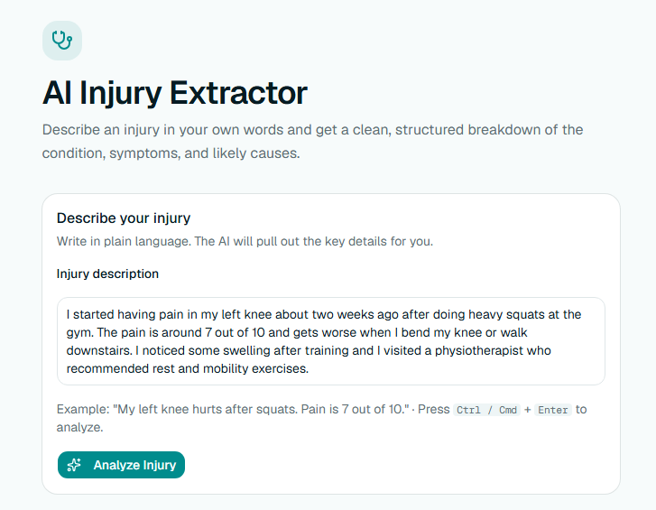
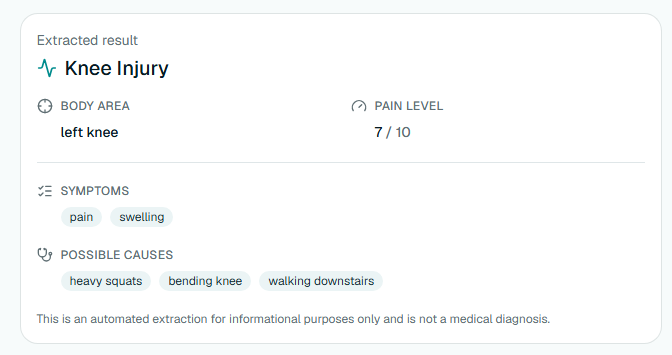
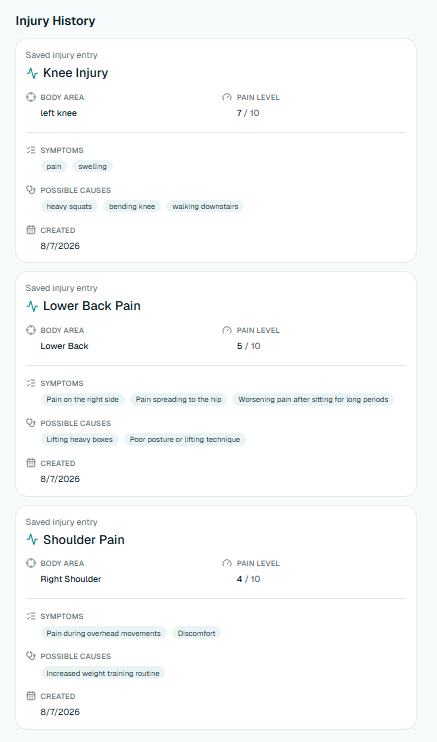
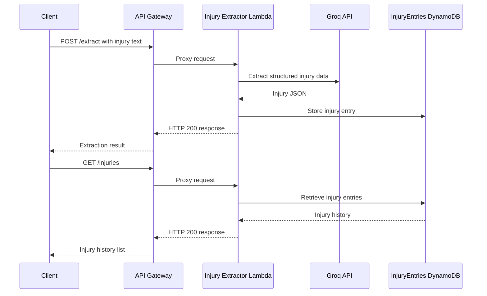

# AI Injury Extractor

A serverless AI-powered application that transforms free-text injury descriptions into structured injury data using AWS Lambda, API Gateway, DynamoDB, Terraform, Groq LLMs, and Next.js. This project demonstrates an end-to-end serverless AWS architecture.

The application accepts free-text injury descriptions, uses an LLM to extract structured information, stores the extracted data in DynamoDB, and exposes REST API endpoints for retrieving previous entries.

## Tech Stack

- Python
- AWS Lambda
- Amazon API Gateway
- Amazon DynamoDB
- Terraform
- Groq API (Llama 3.1)
- GitHub Actions (extractor and frontend CI)

## Features

- Extracts structured injury information from natural language
- Serverless architecture built on AWS
- REST API powered by API Gateway and Lambda
- Stores extracted records in DynamoDB
- Infrastructure managed with Terraform
- Integrated with a Next.js frontend

## Screenshots

### Injury Description Input

Users can describe their injury in natural language and submit it for AI extraction.



### AI Extraction Result

The LLM converts unstructured text into structured injury information.



### Injury History

Previously extracted injuries can be retrieved from DynamoDB through the history API.



## Integration

Although this project is fully functional as a standalone serverless application, it was designed so that the AI extraction component can also be integrated into a larger healthcare application.

In that scenario:

- User authentication would be handled by the host application.
- The AI extraction service would receive authenticated requests.
- Extracted injury data could be persisted in the host application's primary database (for example, PostgreSQL) instead of DynamoDB.

DynamoDB is used in this repository to demonstrate a complete serverless AWS architecture and end-to-end data flow.

## Architecture



## Prerequisites

Before deployment, ensure you have:

- AWS CLI configured with valid credentials
- Terraform installed
- Python 3.12 installed
- Groq API key configured as a Lambda environment variable

## Frontend

The frontend that calls this API now lives in the main app's `frontend/`
(`frontend/app/dashboard/extractor/page.tsx` and
`frontend/components/extractor/`), not in this directory. Run it via the
main `frontend/` app's own README/CLAUDE.md.

It requires `NEXT_PUBLIC_EXTRACTOR_API_URL` to be set to your deployed API
Gateway invoke URL (no trailing slash, no `/extract` or `/injuries` suffix —
the app appends those itself), for example in `frontend/.env.local`:

```
NEXT_PUBLIC_EXTRACTOR_API_URL=https://YOUR_API_ID.execute-api.eu-north-1.amazonaws.com/dev
```

There is currently no local/mocked backend — the frontend always calls a
real deployed API Gateway + Lambda stack.

## Deploy Lambda and Infrastructure

From the Lambda directory:

```bash
cd lambda
./deploy.sh

```

This installs Lambda dependencies into `package/`, zips `function.zip`, and
runs `terraform apply` in `../infrastructure`. It requires AWS CLI
credentials, Terraform, and a `groq_api_key` Terraform variable (e.g. via
`TF_VAR_groq_api_key` or a gitignored `terraform.tfvars`).

The allowed CORS origin is also a Terraform variable, `allowed_origin`
(default `http://localhost:3000`) — set it (e.g. via `TF_VAR_allowed_origin`)
to your deployed frontend's origin when deploying anywhere other than local
dev.

The Groq model id is configurable via the `groq_model` Terraform variable
(default `llama-3.1-8b-instant`, e.g. via `TF_VAR_groq_model`) so it can be
swapped without a code change if the model is deprecated.

## Testing

- Backend: `cd lambda && pytest` (pytest + moto, mocks AWS/Groq). CI runs
  this on every push/PR touching `ai-injury-extractor/lambda/**` or
  `ai-injury-extractor/infrastructure/**` (see `.github/workflows/extractor-ci.yml`).
- Frontend: the extractor's component tests moved along with the
  components into `frontend/components/extractor/*.test.tsx` and
  `frontend/services/extractor-api.test.ts`. The main `frontend/` app now
  runs them with Vitest (`cd frontend && npm test`), also run in CI via
  `.github/workflows/frontend-ci.yml`.

There is no end-to-end/API integration test suite yet — changes touching
request/response behavior should still be verified manually using the
`curl` examples below and by running the frontend against a real deployed
API.

## Test injury data extractor API (Development only)

> This endpoint is currently unauthenticated and intended for development/testing.
> Authentication and authorization are handled by the consuming application and are not implemented in this standalone serverless demo.

```bash
curl -X POST \
https://YOUR_API_ID.execute-api.eu-north-1.amazonaws.com/dev/extract \
-H "Content-Type: application/json" \
-d '{"text":"I have had left hip pain for four years after gym training."}'
```

## Test injury history API (Development only)

> This endpoint retrieves saved injury entries from DynamoDB.
> Authentication is not implemented yet and the endpoint is intended for development/testing.

```bash
curl https://YOUR_API_ID.execute-api.eu-north-1.amazonaws.com/dev/injuries
```

# Useful Commands

## Test Groq API directly

```bash
curl https://api.groq.com/openai/v1/chat/completions \
-H "Authorization: Bearer YOUR_GROQ_API_KEY" \
-H "Content-Type: application/json" \
-d '{
  "model": "llama-3.1-8b-instant",
  "messages": [
    {
      "role": "user",
      "content": "Say hello"
    }
  ]
}'
```

---

## Update Lambda code

```bash
aws lambda update-function-code \
--function-name injury-extractor \
--zip-file fileb://function.zip
```

---

## Update Lambda environment variable

```bash
aws lambda update-function-configuration \
--function-name injury-extractor \
--environment "Variables={GROQ_API_KEY=YOUR_KEY,GROQ_MODEL=llama-3.1-8b-instant,DYNAMODB_TABLE=InjuryEntries,ALLOWED_ORIGIN=http://localhost:3000}"
```

---

## Get current Lambda environment variables

```bash
aws lambda get-function-configuration \
--function-name injury-extractor
```

---

## Tail Lambda logs

```bash
aws logs tail /aws/lambda/injury-extractor --follow
```

---

## Invoke Lambda directly

```bash
aws lambda invoke \
--function-name injury-extractor \
--cli-binary-format raw-in-base64-out \
--payload '{"body":"{\"text\":\"I have hip pain\"}"}' \
response.json

cat response.json
```

---

## Inspect DynamoDB table (development only)

Scan all injury entries:

```bash
aws dynamodb scan \
--table-name InjuryEntries
```

---

## Zip Lambda package

PowerShell

```powershell
Remove-Item function.zip -ErrorAction Ignore

Compress-Archive -Path handler.py,package\* -DestinationPath function.zip
```

## Troubleshooting

### ModuleNotFoundError

Reinstall dependencies into the `package/` directory and recreate `function.zip`.

### Lambda updated but code didn't change

Upload a new `function.zip` and verify the `LastModified` timestamp in the Lambda console.

### Groq returns 401

- Verify `GROQ_API_KEY`
- Test the API directly with `curl`
- Confirm the key is active

### API Gateway returns 500

Check CloudWatch logs:

```bash
aws logs tail /aws/lambda/injury-extractor --follow
```

### API Gateway returns 403

Verify the endpoint URL and deployment stage.

### API Gateway returns 404

Confirm the API Gateway resources and methods are deployed:

- `/extract` with `POST`
- `/injuries` with `GET`

After changing Terraform resources, create a new deployment.
