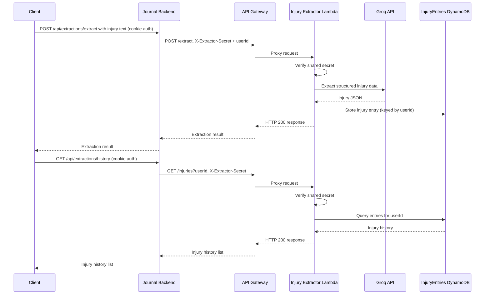

# AI Injury Extractor

A serverless AI-powered application that transforms free-text injury descriptions into structured injury data using AWS Lambda, API Gateway, DynamoDB, Terraform, Groq LLMs, and Next.js. This project demonstrates an end-to-end serverless AWS architecture.

The application accepts free-text injury descriptions, uses an LLM to extract structured information, stores the extracted data in DynamoDB, and exposes REST API endpoints for retrieving previous entries.

## Tech Stack

- Python
- AWS Lambda
- Amazon API Gateway
- Amazon DynamoDB
- Terraform
- Groq API (Llama 3.1)
- GitHub Actions (extractor and frontend CI)

## Features

- Extracts structured injury information from natural language
- Serverless architecture built on AWS
- REST API powered by API Gateway and Lambda
- Stores extracted records in DynamoDB
- Infrastructure managed with Terraform
- Integrated with a Next.js frontend

## Screenshots

### Injury Description Input

Users can describe their injury in natural language and submit it for AI extraction.


### AI Extraction Result

The LLM converts unstructured text into structured injury information.


### Injury History

Previously extracted injuries can be retrieved from DynamoDB through the history API.


## Integration

This was designed as a standalone serverless demo, then integrated into the injury_journal monorepo. That integration is now real (issue #32), not just intended:

- User authentication is handled by the host application (`backend/`), which verifies the caller's JWT.
- This API receives requests only from that host application's backend, proven by a shared secret (`X-Extractor-Secret`) it checks before doing anything else — the browser no longer calls it directly.
- Extracted injury data is scoped per user (the `userId` the host app resolved), not a single hardcoded id.

Extraction records still live in this repository's own DynamoDB table, separate from the host app's primary PostgreSQL database.

DynamoDB is used in this repository to demonstrate a complete serverless AWS architecture and end-to-end data flow.

## Architecture



## Prerequisites

Before deployment, ensure you have:

- AWS CLI configured with valid credentials
- Terraform installed
- Python 3.12 installed
- Groq API key configured as a Lambda environment variable

## Frontend

The frontend that calls this API now lives in the main app's `frontend/`
(`frontend/app/dashboard/extractor/page.tsx` and
`frontend/components/extractor/`), not in this directory. Run it via the
main `frontend/` app's own README/CLAUDE.md.

It does not call this Lambda directly — the browser has no way to attach the
shared secret this Lambda now requires, and never had a way to reach it
without going through an authenticated caller. It calls the main app's own
`backend/` (`NEXT_PUBLIC_API_URL`), which proxies to this Lambda with the
shared secret and the caller's resolved userId; see
`backend/src/services/extractorService.js`. Set `EXTRACTOR_API_URL` and
`EXTRACTOR_SHARED_SECRET` in the repo-root `.env` for that proxy to work (see
root `.env.example`).

There is currently no local/mocked backend for the Lambda itself — the proxy
always calls a real deployed API Gateway + Lambda stack.

## Deploy Lambda and Infrastructure

From the Lambda directory:

```bash
cd lambda
./deploy.sh

```

This installs Lambda dependencies into `package/`, zips `function.zip`, and
runs `terraform apply` in `../infrastructure`. It requires AWS CLI
credentials, Terraform, and an `extractor_shared_secret` Terraform variable
(e.g. via `TF_VAR_extractor_shared_secret` or a gitignored `terraform.tfvars`).
`extractor_shared_secret` must match the main app's `EXTRACTOR_SHARED_SECRET`
(root `.env`) — it's how the Lambda verifies who's calling; generate one with
`node -e "console.log(require('crypto').randomBytes(32).toString('hex'))"`.

### Storing the Groq API key

The key is **not** a Terraform variable and **not** a Lambda environment
variable — Terraform writes environment variable values into its state file in
plaintext, which would leak the key to anyone who can read the state. Terraform
instead creates an empty AWS Secrets Manager secret, and you write the value
into it out of band:

```bash
aws secretsmanager put-secret-value \
--secret-id injury-extractor/groq-api-key \
--secret-string 'YOUR_GROQ_KEY'
```

Store the key as **plaintext**, exactly as above — not as a key/value pair. The
Lambda uses the whole `SecretString` as the key, so a JSON object (what the AWS
console's "Other type of secret" flow produces by default) is read literally and
Groq rejects it with a 401.

Run this straight after `terraform apply` on a stack that has no value stored
yet — the first deploy, and again after any `terraform destroy`, since the
secret is configured for immediate deletion with no recovery window. Until it is
run the secret exists with no value, the Lambda fails at initialization, and
every request errors (see Troubleshooting).

If you deployed this stack before the key moved into Secrets Manager, delete the
old plaintext copies once rotation is done: `infrastructure/terraform.tfvars`
and any `TF_VAR_groq_api_key` export in your shell profile. Do **not** delete
`infrastructure/terraform.tfstate` or `terraform.tfstate.backup` to do this —
that's Terraform's live record of every resource this stack actually deployed,
and removing it would make the next `apply` try to recreate real
infrastructure from scratch. A stale `groq_api_key` entry in `terraform.tfvars`
also refers to a variable this module no longer declares, and Terraform will
flag it on the next apply.

There is no CORS variable any more — this API has no browser caller.

The Groq model id is configurable via the `groq_model` Terraform variable
(default `openai/gpt-oss-20b`, e.g. via `TF_VAR_groq_model`) so it can be
swapped without a code change if the model is deprecated.

## Testing

- Backend: `cd lambda && pytest` (pytest + moto, mocks AWS/Groq). CI runs
  this on every push/PR touching `ai-injury-extractor/lambda/**` or
  `ai-injury-extractor/infrastructure/**` (see `.github/workflows/extractor-ci.yml`).
- Frontend: the extractor's component tests moved along with the
  components into `frontend/components/extractor/*.test.tsx` and
  `frontend/services/extractor-api.test.ts`. The main `frontend/` app now
  runs them with Vitest (`cd frontend && npm test`), also run in CI via
  `.github/workflows/frontend-ci.yml`.

There is no end-to-end/API integration test suite yet — changes touching
request/response behavior should still be verified manually using the
`curl` examples below and by running the frontend against a real deployed
API.

## Test injury data extractor API

> Requires the shared secret and a userId — see "Integration" above. A request without a matching `X-Extractor-Secret` gets a 403 regardless of body content.

```bash
curl -X POST \
https://YOUR_API_ID.execute-api.eu-north-1.amazonaws.com/dev/extract \
-H "Content-Type: application/json" \
-H "X-Extractor-Secret: YOUR_SHARED_SECRET" \
-d '{"userId":"1","text":"I have had left hip pain for four years after gym training."}'
```

## Test injury history API

> Also requires the shared secret; `userId` is a query parameter since GET has no body.

```bash
curl "https://YOUR_API_ID.execute-api.eu-north-1.amazonaws.com/dev/injuries?userId=1" \
-H "X-Extractor-Secret: YOUR_SHARED_SECRET"
```

# Useful Commands

## Test Groq API directly

```bash
curl https://api.groq.com/openai/v1/chat/completions \
-H "Authorization: Bearer YOUR_GROQ_API_KEY" \
-H "Content-Type: application/json" \
-d '{
  "model": "llama-3.1-8b-instant",
  "messages": [
    {
      "role": "user",
      "content": "Say hello"
    }
  ]
}'
```

---

## Update Lambda code

```bash
aws lambda update-function-code \
--function-name injury-extractor \
--zip-file fileb://function.zip
```

---

## Rotate or change the Groq API key

The key lives in Secrets Manager, so changing it needs no deploy — just a new
secret value. The Lambda picks it up on its next cold start; force one sooner by
re-deploying or touching the function configuration.

```bash
aws secretsmanager put-secret-value \
--secret-id injury-extractor/groq-api-key \
--secret-string 'YOUR_NEW_GROQ_KEY'
```

---

## Update Lambda environment variables

Note `GROQ_SECRET_ARN` — the ARN of the secret, not the key. All four must be
passed: this command replaces the whole environment rather than merging into it.

```bash
aws lambda update-function-configuration \
--function-name injury-extractor \
--environment "Variables={GROQ_SECRET_ARN=arn:aws:secretsmanager:eu-north-1:ACCOUNT_ID:secret:injury-extractor/groq-api-key-SUFFIX,GROQ_MODEL=openai/gpt-oss-20b,DYNAMODB_TABLE=InjuryEntries,EXTRACTOR_SHARED_SECRET=YOUR_SECRET}"
```

---

## Get current Lambda environment variables

```bash
aws lambda get-function-configuration \
--function-name injury-extractor
```

---

## Tail Lambda logs

```bash
aws logs tail /aws/lambda/injury-extractor --follow
```

---

## Invoke Lambda directly

```bash
aws lambda invoke \
--function-name injury-extractor \
--cli-binary-format raw-in-base64-out \
--payload '{"httpMethod":"POST","headers":{"X-Extractor-Secret":"YOUR_SHARED_SECRET"},"body":"{\"userId\":\"1\",\"text\":\"I have hip pain\"}"}' \
response.json

cat response.json
```

---

## Inspect DynamoDB table (development only)

Scan all injury entries:

```bash
aws dynamodb scan \
--table-name InjuryEntries
```

---

## Zip Lambda package

PowerShell

```powershell
Remove-Item function.zip -ErrorAction Ignore

Compress-Archive -Path handler.py,package\* -DestinationPath function.zip
```

## Troubleshooting

### ModuleNotFoundError

Reinstall dependencies into the `package/` directory and recreate `function.zip`.

### Lambda updated but code didn't change

Upload a new `function.zip` and verify the `LastModified` timestamp in the Lambda console.

### Groq returns 401

- Confirm a key is stored, without printing it (the plain
  `get-secret-value` response includes the key in plaintext):
  `aws secretsmanager get-secret-value --secret-id injury-extractor/groq-api-key --query SecretString --output text | wc -c`
- Test the API directly with `curl`
- Confirm the key is active in the Groq console
- After storing a new value, the running Lambda container keeps using the old
  key until its next cold start

### API Gateway returns 502 and the browser reports a CORS error

An initialization failure, not a request failure. The handler builds its
`Access-Control-Allow-Origin` header per response, so when the module fails to
import, API Gateway returns a bare 502 with no CORS headers and the browser
surfaces it as a CORS error rather than the real cause.

The usual reason is that the secret exists but has no value yet — run the
`put-secret-value` command from "Storing the Groq API key" above. Confirm with:

```bash
aws logs tail /aws/lambda/injury-extractor --follow
```

### API Gateway returns 500

Check CloudWatch logs:

```bash
aws logs tail /aws/lambda/injury-extractor --follow
```

### API Gateway returns 403

Verify the endpoint URL and deployment stage.

### API Gateway returns 404

Confirm the API Gateway resources and methods are deployed:

- `/extract` with `POST`
- `/injuries` with `GET`

After changing Terraform resources, create a new deployment.
